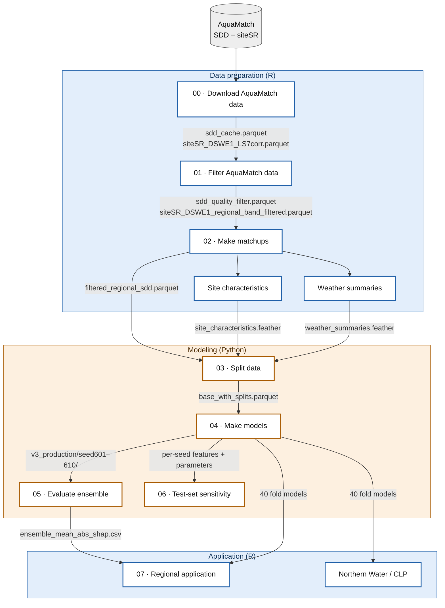

# Regional Remote Sensing Clarity Model

Primary repository contact: B Steele

Repository containing the regional clarity model using Landsat Collection 2 SR product data via AquaSat v2 data products (siteSR, lakeSR, )

This repository is covered by the MIT use license. We request that all downstream uses of this work be available to the public when possible.

**Rendered workflow:** <https://rossyndicate.github.io/regional-clarity-RS-model/>. Every step below is also a page on that site, with its code and outputs.

## Workflow

Data preparation and application run in R (`.Rmd`). Modeling runs in Python notebooks (`.ipynb`) that share the modules in `regional_clarity/python/`. Arrows are labeled with the main file each step hands to the next. Data files live under `regional_clarity/aquamatch_files/` and models under `regional_clarity/xg_models/`; neither is tracked in git.

<!-- keep in sync with pipeline_diagram.mmd, which the Quarto site renders -->


| Step | File | What it does |
|---|---|---|
| 00 | [`00_download_AquaMatch_data.Rmd`](regional_clarity/00_download_AquaMatch_data.Rmd) | Download AquaMatch SDD and siteSR; apply Landsat 7-referenced handoffs. Run by hand only when AquaMatch changes. |
| 01 | [`01_filter_AquaMatch_Data.Rmd`](regional_clarity/01_filter_AquaMatch_Data.Rmd) | Scope to the 6-state HUC4 region; SDD QC and RANSAC; siteSR scene QA and band RANSAC. |
| 02 | [`02_make_matches.Rmd`](regional_clarity/02_make_matches.Rmd) | 5-day matchups, rain-event filter, closest image per sample. |
| – | [`pull_site_characteristics.Rmd`](regional_clarity/pull_site_characteristics.Rmd), [`pull_weather_summaries.Rmd`](regional_clarity/pull_weather_summaries.Rmd) | Elevation, LakeCat, and gridMET antecedent-weather features. Re-run only when the site set changes. |
| 03 | [`03_split_data.ipynb`](regional_clarity/03_split_data.ipynb) | Join features; fixed HUC8 holdout and CV folds. |
| 04 | [`04_make_models.ipynb`](regional_clarity/04_make_models.ipynb) | Per-seed feature selection, tuning, and 4-fold XGBoost (10 seeds × 4 folds). |
| 05 | [`05_evaluate_ensemble.ipynb`](regional_clarity/05_evaluate_ensemble.ipynb) | Ensemble holdout performance and SHAP. |
| 06 | [`06_test_set_sensitivity.ipynb`](regional_clarity/06_test_set_sensitivity.ipynb) | Holdout RMSE across 16 holdout draws. |
| 07 | [`07_regional_application.Rmd`](regional_clarity/07_regional_application.Rmd) | Apply the ensemble at in situ SDD locations, with training-domain and AOA checks. |
| – | [`Northern_Water_application.Rmd`](NW_CLP_application/Northern_Water_application.Rmd) | Out-of-sample application to Northern Water / Cache la Poudre. |

Manuscript tables and figures are built by [`manuscript_tables_figures.Rmd`](regional_clarity/asv2_manuscript/manuscript_tables_figures.Rmd), kept for reproducibility and not part of the rendered site.

Each file opens with a header listing its purpose, inputs, outputs, the working directory to run it from, and links to the previous and next steps.

## Python environment

The modeling notebooks (03–06) and `regional_clarity/python/` run in a virtual environment built with Python 3.11. The production run used 3.11.16. From the repository root:

```
python3.11 -m venv .venv
.venv/bin/python -m pip install -r requirements-lock.txt
.venv/bin/python -m ipykernel install --user --name regional_clarity --display-name "regional_clarity" \
  --env KMP_DUPLICATE_LIB_OK TRUE --env OMP_NUM_THREADS 4 --env MKL_NUM_THREADS 4 --env VECLIB_MAXIMUM_THREADS 4
```

- `requirements-lock.txt` pins every package, including transitive dependencies, to the versions used for the production results. `requirements.txt` lists only the direct dependencies, with the same pins, for reading or for a looser install.
- The notebooks' kernel is named `regional_clarity`, so the last command makes them open in this environment in Jupyter, VS Code, and Positron.
- The `--env` flags are required on macOS. Without them, XGBoost and LightGBM load competing OpenMP runtimes and oversubscribe the CPU, and backward elimination in 04 can stall for hours. Registering the kernel this way sets them for every notebook run. If you run the modules outside Jupyter, export the same four variables first.
- Run notebooks from `regional_clarity/`, which Jupyter does by default. To execute one headlessly: `cd regional_clarity && ../.venv/bin/jupyter nbconvert --to notebook --execute --inplace --ExecutePreprocessor.timeout=-1 06_test_set_sensitivity.ipynb`.

## Building the site

The site is a [Quarto](https://quarto.org) website (`_quarto.yml`, `index.qmd`). It builds into `_site/` (not tracked) and is published to the `gh-pages` branch, which GitHub Pages serves. Quarto ships with RStudio and Positron. From the repository root:

```
quarto render                                          # whole site, into _site/
quarto render regional_clarity/02_make_matches.Rmd     # one page
quarto preview                                         # local preview with live reload
quarto publish gh-pages                                # render and push to the gh-pages branch
```

- **Notebooks are never executed by Quarto.** Their pages use the outputs saved in the `.ipynb`, so run a notebook and save it before rendering.
- **Rmds are executed, then frozen.** Results are stored in `_freeze/` (tracked in git) and reused until that Rmd's source changes. Commit `_freeze/` along with the Rmd so the site can be rebuilt without the data. The slow steps inside each Rmd are cached to disk, so a re-render mostly reloads those caches.
- The two `pull_*` Rmds are shown as code only (`execute: eval: false` in their front matter) so a site build never re-runs the web fetches.
- `Northern_Water_application.Rmd` reads the NW Secchi record through a `data/` symlink at the repository root (untracked), pointing to the `NASA_NW` data folder on the ROSS team OneDrive, and reads the NW/CLP remote sensing data from a sibling clone of `NW-CLP-RS`.
- Keep the diagram above in sync with `pipeline_diagram.mmd`.

## Secrets/credentials

API keys and other credentials are stored locally in a `.Renviron` file (untracked by git). This workflow requires an API key for accessing the
EDI data repository. Copy `.Renviron.example` to `.Renviron` and fill in real values. R loads `.Renviron` automatically at session start; access 
values in code with `Sys.getenv("KEY_NAME")`.
