# Regional Clarity RS Model — overview of Claude's work

Six reports, built in sequence, all predicting Secchi disk depth (SDD, water clarity) from Landsat surface reflectance across a 6-state Mountain West region. All reports live under `regional_clarity/` currently on branch `outlier-removal-rework`.

---

## 1. The foundational model

**[Full report](outlier_rework/python/report.html)**

Built the modeling pipeline from scratch: training-data construction (5-day Landsat/field-sample matching, 12,637 rows), cross-sensor harmonization, feature engineering, and a three-way model comparison (XGBoost, LightGBM, a feedforward neural net) under 5-fold HUC4 spatial CV. This is stored in the `outlier_rework` folder.

**Takeaway:** the final, properly-tuned production config (16-feature intersection set, gap-aware hyperparameters, SDD-weighted for the tree models) reached test RMSE **1.86m (XGBoost) / 1.83m (LightGBM) / 1.84m (NN)**, R²≈0.45–0.48. This careful, regularized final  actually did slightly worse on the held-out test partition than an earlier, richer 33-feature/unweighted checkpoint (RMSE 1.747m, R²=0.508), but this is not a meaninful loss of performance. Of note, there is significant benching at higher observed Secchi. We dig into why this might be happening in the subsequent reports.

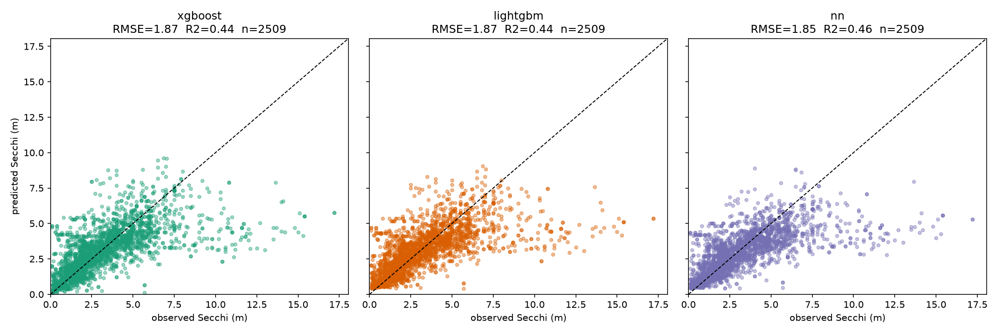

*Predicted vs. observed Secchi depth on the test partition, one panel per model.*

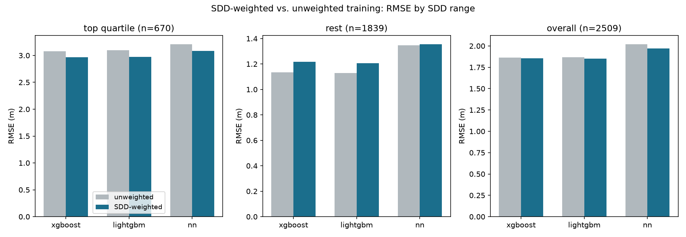

*RMSE/MAE/R²/bias by model, test set. Note scale differences between panels.*

**SHAP/feature assessment:** optical/spectral features dominate attribution, with site and weather covariates contributing the remainder; this optical-dominance finding holds throughout every later report in this series.

**SDD-weighting note (corrected):** the production config already applies SDD-weighting (k=2.0) to both tree models — this note originally cited numbers from a stale artifact (an early 13-feature optical-only candidate, not the actual final 16-feature production set); regenerated against the real production config, and now matches this report's own published test numbers exactly. For XGBoost: top-quartile RMSE improves 2.385→2.230m and top-quartile bias moves toward zero (−1.28→−1.01m) — but **overall RMSE gets worse, not better** (1.809→1.860m), and overall bias moves further from zero (+0.233→+0.409m), because the "rest" group (73% of the data) degrades on both metrics (RMSE 1.546→1.705m). LightGBM shows the identical shape. Weighting is retained in production anyway — that was always a deliberate trade for tail accuracy, not a claim that it wins on every metric, but the original "bias improves in every slice" framing was wrong. The NN row could not be safely regenerated (a reproducible PyTorch/OpenMP conflict on this machine) and is left as originally reported — NN stays unweighted in production regardless, so this doesn't affect the adopted config.

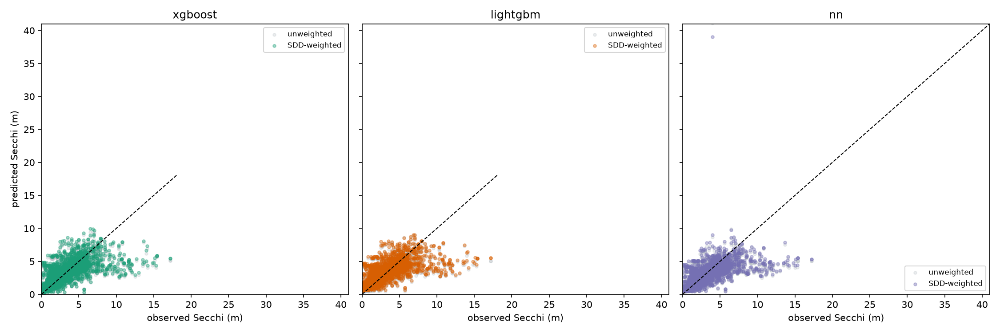

*Predicted vs. observed, unweighted vs. SDD-weighted, side by side.*

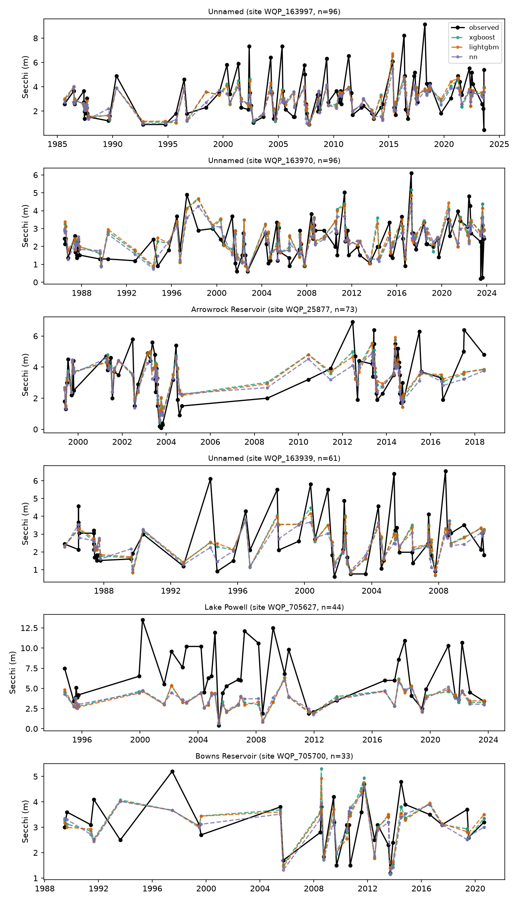

*Observed vs. predicted Secchi depth over time, a handful of longer-record test sites, named where a GNIS name exists.*

---

## 2. Adding gap aware tuning and adding shoreline proximity flag

**[Full report](outlier_rework_v2/python/report.html)**

Closed two threads v1 identified as opportunities: gap-aware hyperparameter selection applied at *every* tuning stage (not just the final one), and a shoreline-proximity flag added as a candidate feature. The gap-aware hyperparameter selection is a method where models that perform within 2% of the best validation RMSE are re-ranked according to the difference between the traning and validation RMSE. This should help root out models where there is over-training and over-parameterization. This is stored in the `outlier_rework_v2` folder.

**Takeaway:** the shoreline flag survived backward elimination in all 3 models. These changes resulted in a negligible positive impact across the tree-based models (XGBoost 1.860→1.839m, LightGBM 1.830→1.815m) and a slightly worse result for the NN (1.839→1.888m). Optical signal still dominates attribution (61–68%). These two threads will be retained in future work.

*Predicted vs. observed, test set.*

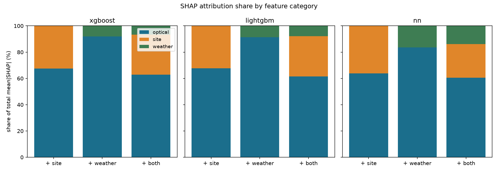

*SHAP contribution by feature group (optical/site/weather).*

**SDD-weighting note (corrected):** this note previously said weighting was "not adopted as the default" for v2 — that was wrong, based on the same stale 13-feature artifact as v1's note above. **v2's actual adopted production config already is SDD-weighted for XGBoost/LightGBM**, same as v1 (see this report's "Final production configuration" section: `weighted: true` for both tree models) — this was never a live decision to revisit, just my own mis-citation. Regenerated against the real final 16-feature+shore_flag config: XGBoost top-quartile RMSE improves 2.610→2.485m and bias moves toward zero (−1.41→−1.20m), but overall RMSE gets worse (1.813→1.839m, exactly matching this report's own published production number) and overall bias moves further from zero (+0.153→+0.313m) as the "rest" group degrades (RMSE 1.415→1.538m). LightGBM matches. So: v2 is already consistent with v1 (both weight the tree models, matching the user's expectation) — the trade-off is real and it's the same trade-off v1 makes, not a cleaner win than v1 had. NN row unregenerated for the same OpenMP-conflict reason as v1; NN stays unweighted in production regardless.

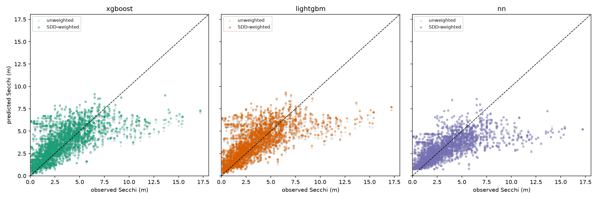

*Predicted vs. observed, unweighted vs. SDD-weighted, side by side.*

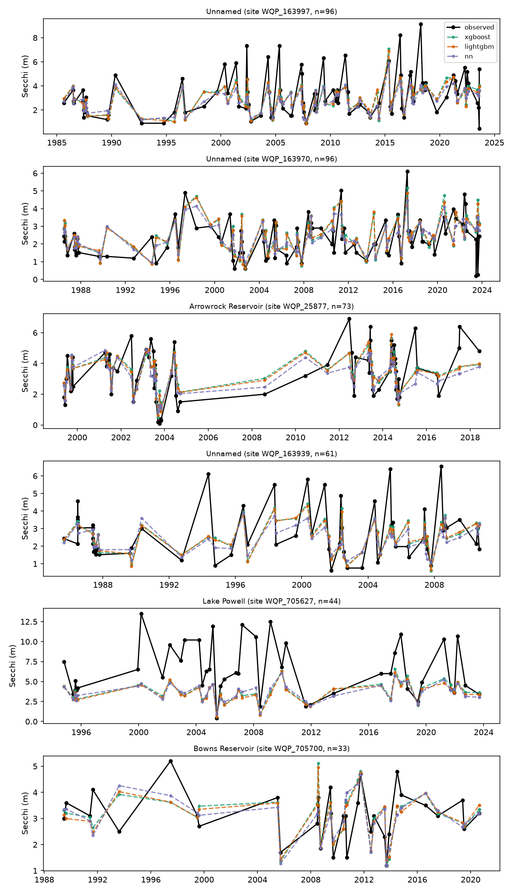

*Observed vs. predicted Secchi depth over time, a handful of longer-record test sites, named where a GNIS name exists.*

---

## 3. Why do two partitions of the TVT split perform wose than others?

**[Full report](outlier_investigation/report.html)**

This report asks why partition 5 (test) and partition 3 (the worst CV fold) peformed poorly in the first two versions of the model: is there something functionally different about these poor-performing partitions? This is stored in the `outlier_investigation` folder.

**Takeaway:** every model compresses predictions toward the dataset mean above ~6–10m SDD, which we suspect (and has historically been shown) is a real Landsat optical-retrieval limit, not a modeling defect) — partitions 3 and 5 concentrate that pattern 2–3x their proportional share. Partition 3 is 54% one forested, naturally-clear lake HUC4 (HUC4 1701); partition 5 is dominated by Lake Powell (HUC4 1407), which also sits at the 97th percentile of its own training data for catchment area. The reason these do not perform well is that the features exist at the edge of and beyond the training data envelope which exacerbates the Landsat signal problem - this is most clear in the example of Lake Powell whose catchment is many times larger than anything in the training and validation sets.

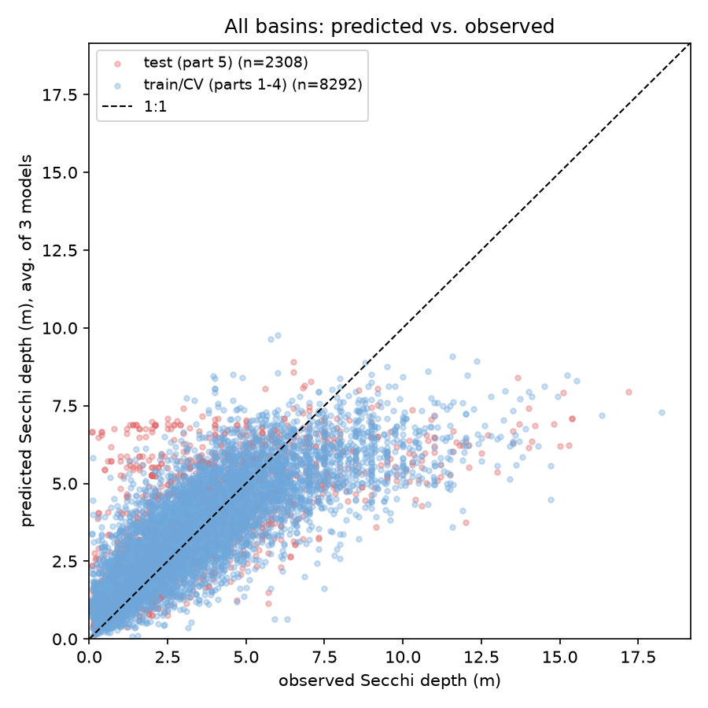

*Predicted vs. observed SDD, all basins, CV and test combined, 3-model average.*

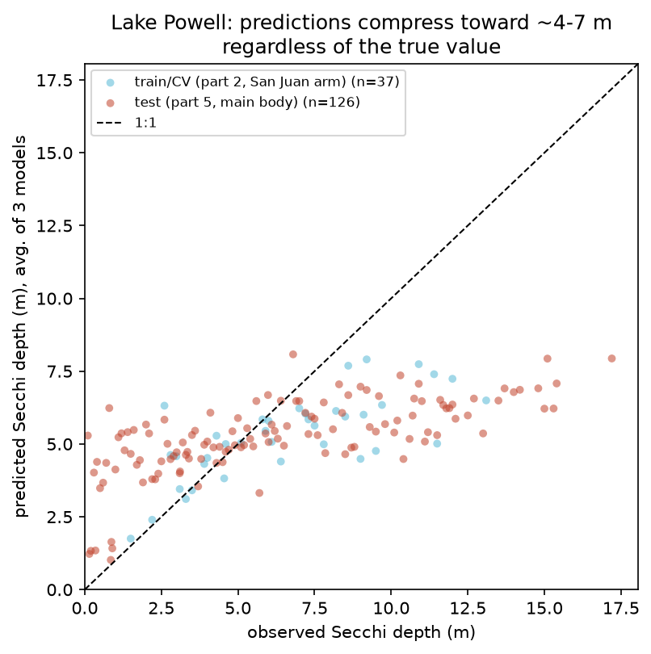

*Predicted vs. observed SDD at Lake Powell.*

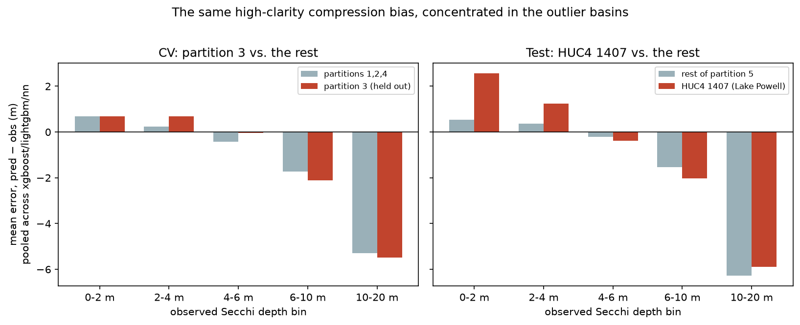

*Prediction compression toward the dataset mean above ~6–10m SDD, by partition.*

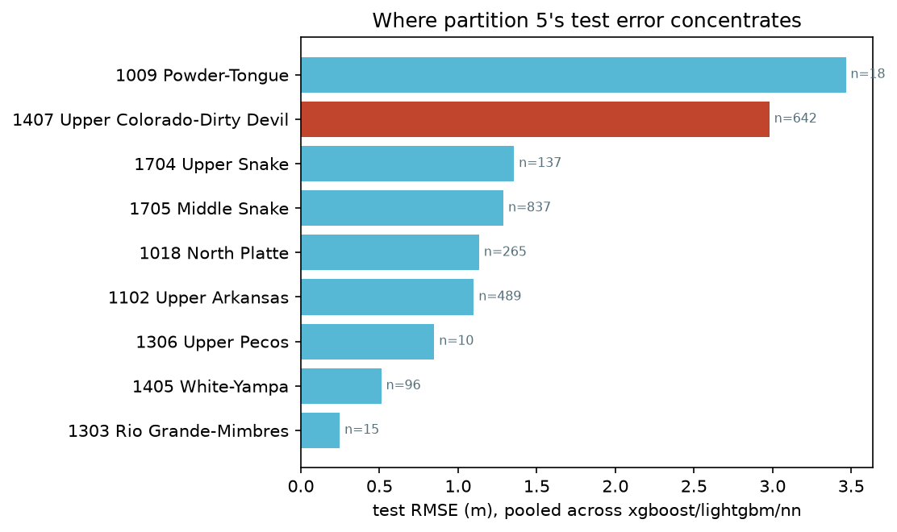 

*Test RMSE by HUC4 basin.

**HUC4 1009 (Powder-Tongue) note:** at the individual-HUC4 level (not partition level), 1009 is actually the single worst-performing basin in the test set (RMSE 3.47m, worse than Lake Powell's 2.98m), despite only 54 test rows/13 sites and feature values that sit comfortably mid-distribution (not an extrapolation case like Lake Powell). Nearly all of its error traces to one lake, Lake De Smet, whose observed SDD readings (9.75–14.1m) sit in the sparsest 1.7% of the training label distribution. This is directly attributed to the compression-above-6–10m mechanism as above, just concentrated in one very-clear lake with almost no training analogs rather than a large catchment or a geographic cluster.

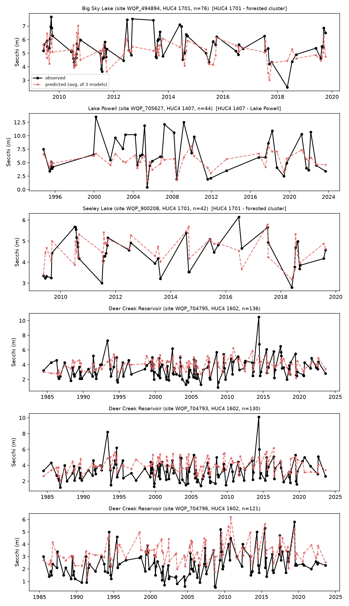

*Observed vs. predicted Secchi depth over time, prioritizing Lake Powell and HUC4 1701 sites, named where a GNIS name exists.*

**SHAP/feature assessment:** this report reuses v1's frozen model unchanged, so no new SHAP was computed here — see report 1's SHAP figures for feature attribution on this exact model. The physical-envelope diagnostics above (catchment area, forest cover) are this report's own, complementary evidence for *why* two basins fail, arrived at independently of SHAP.

---

## 4. Is the current poor performance in partitions a fluke of splitting the data?

**[Full report](partition_sensitivity/report.html)**

We tested whether partitions 3/5's problem is an artifact of the one HUC4-grouped split every prior report used. This exploration uses v1's frozen model (same 16 features, same hyperparameters) unchanged, so this report's own contribution is entirely about how RMSE moves under different split designs. Since the NN does not show any improvement over the tree-based methods, we do not continue buildiing NN models from this point forward. This is stored in the `partition_sensitivity` folder.

**Takeaway:** This is a structural problem when using HUC4 as a split point. Rotating which HUC4 partition reproduces partitions 3 and 5 as consistently worst regardless of training/validation or test set. To try to address this, we attempted to paritition via HUC8 resolution with the same algorithm. When done with a single random seed, this just relocates the provlem (a different partition becomes worst). Randomizing HUC8 assignment order helps on average (~10–18% less rotation-to-rotation spread) but not for every seed. Conclusion: the only viable fix is an ensemble across many split assignments.

For reference: "greedy" here means deterministic size-balanced bin-packing — HUC4/HUC8 groups are processed in one fixed, sorted order and each is placed into whichever partition is currently smallest, with no randomness involved. The "randomized" HUC8 scheme runs that identical bin-packing objective but shuffles the processing order of HUC8 units per seed before packing, so which units land together changes seed to seed even though partition sizes stay balanced either way.

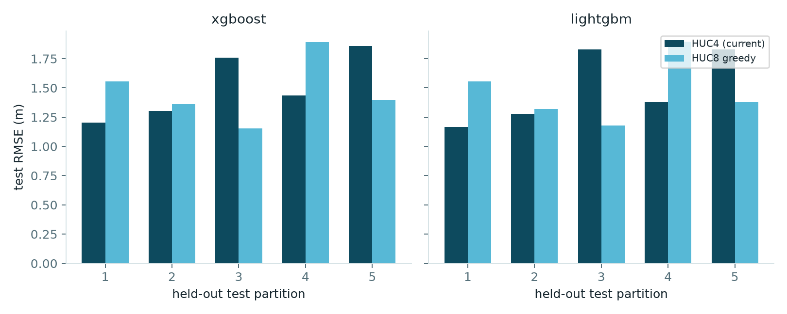

*RMSE by partition (x-axis) using the HUC4 scale (dark blue) or the HUC8 scale (light blue) for assignment using the greedy assignment method.*

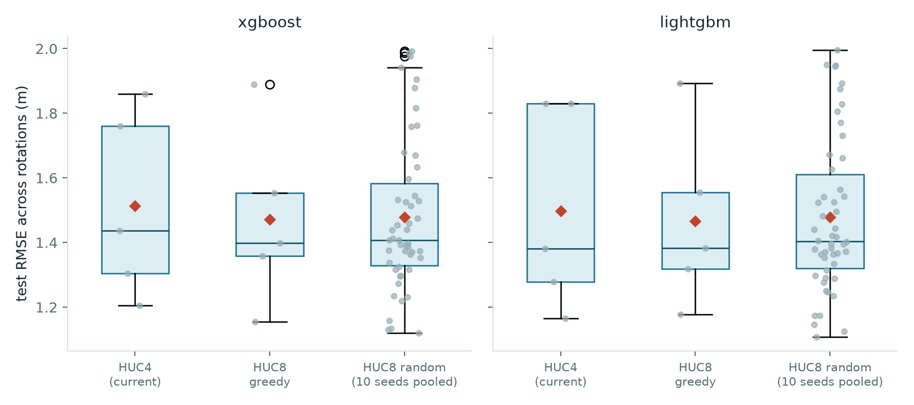

*Rotation-to-rotation RMSE spread, by split scheme (HUC4 greedy, HUC8 greedy, HUC8 randomized).*

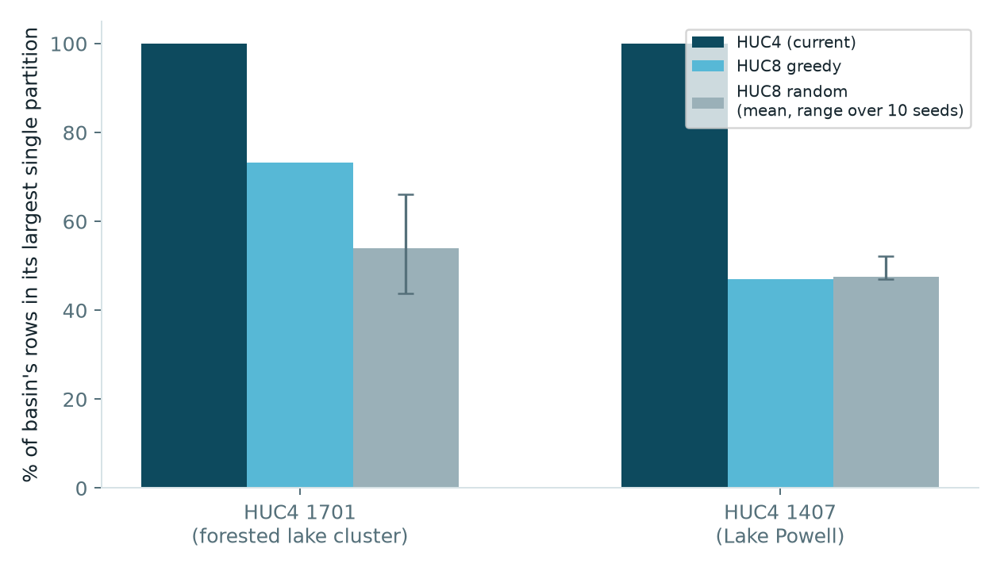

*How concentrated the hard-to-predict HUC4 basins are within a single partition, by scheme.*

## 5. An ensemble-based rebuild

**[Full report](outlier_rework_v3/report.html)**

A full top-to-bottom rebuild on an ensemble: one fixed holdout no model ever trains on, plus 5 independent HUC8-random CV-fold arrangements, each running its own complete feature-selection + tuning pipeline. This is stored in the `outlier_rework_v3` folder.

**Takeaway:** performs marginally better than the initial foundational model RMSE 1.432→1.391m (−2.9%), MAE −4.5%. Importantly, v1's systematic over-prediction bias very nearly eliminated (+0.142m → +0.009m). `shore_flag` survives unanimously (10/10 seeds×models). SHAP confirms the model leans on physically sensible features and independently re-derives the Lake Powell finding from report 3 via a completely different method (its catchment-area importance is concentrated almost entirely at that one basin). As a note, v1's originally-published test-set bias was substantially larger, +0.409m (XGBoost, n=2,509), but that was measured on v1's  original test partition. The "+0.142m" number above comes from refitting v1's frozen feature set and hyperparameters on v3's splits and evaluating against v3's more balanced holdout. ~90% of v3's holdout rows were part of v1's own training/validation in v1's model, so this is not an apples-to-apples comparison. v3's own ensemble excludes this holdout at every stage: feature selection, hyperparameter tuning, and training, resulting in the net effect that this comparison is biased and it likely understates v3's true improvement over the v1 performance.

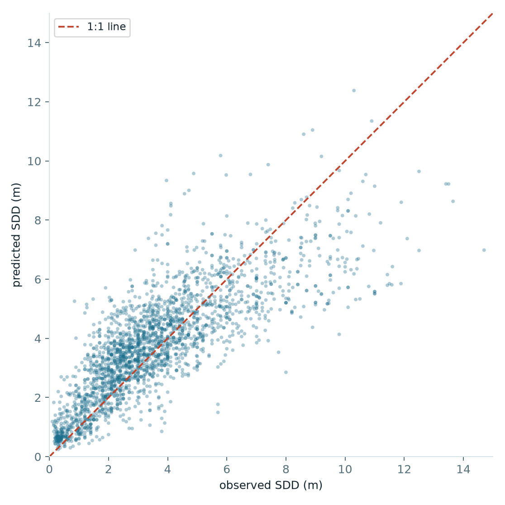

*Predicted vs. observed SDD, v3 5-seed×2-model ensemble, fixed holdout.*

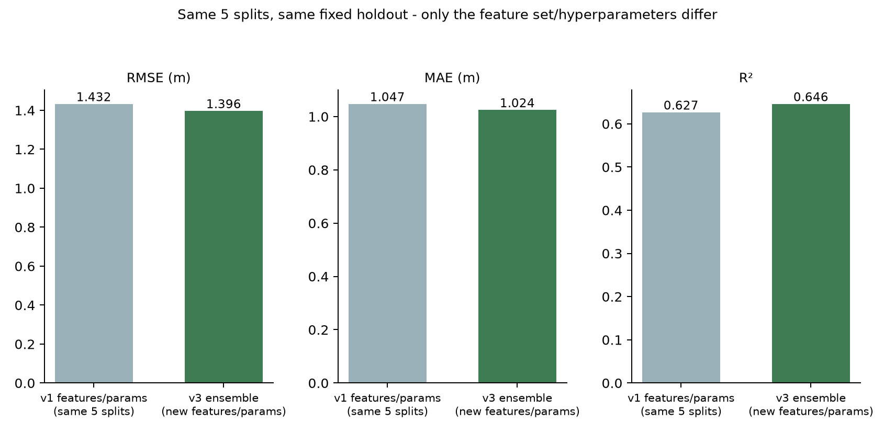

*v1's frozen config, retrained on v3's splits, vs. v3's own ensemble. Note that the original performance of the holdout for the v1 model was an RMSE of **1.86m (XGBoost) and 1.83m (LightGBM)* and a *r-squared of 0.45-0.48* and the performance here includes data that was in the training/validation set of the original v1 model.

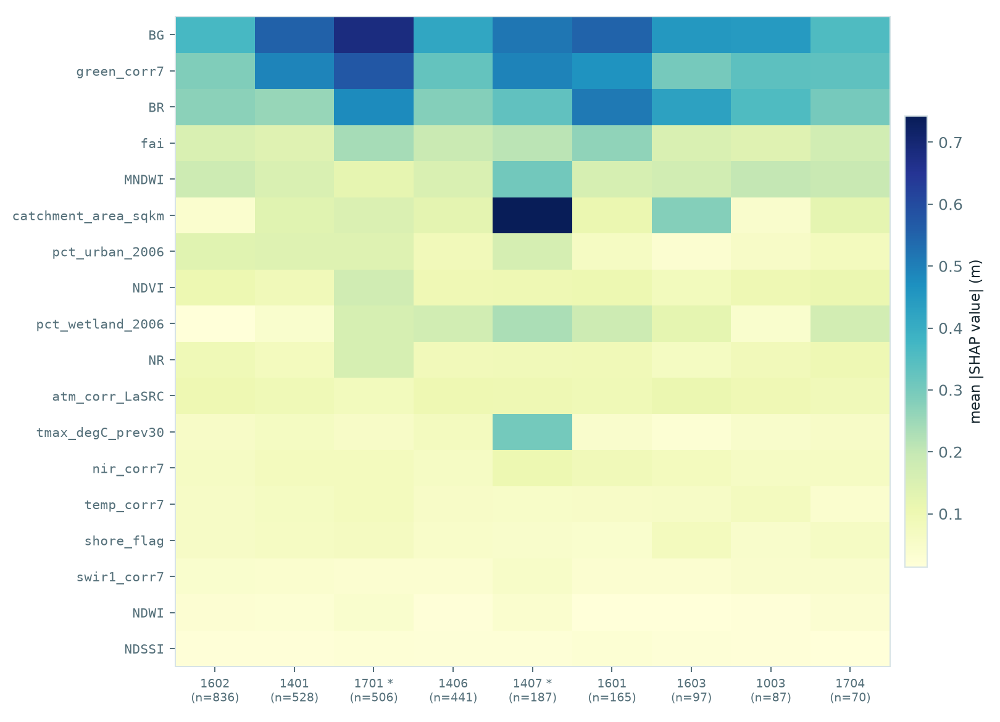

*Mean |SHAP value| per feature, broken out by HUC4.*

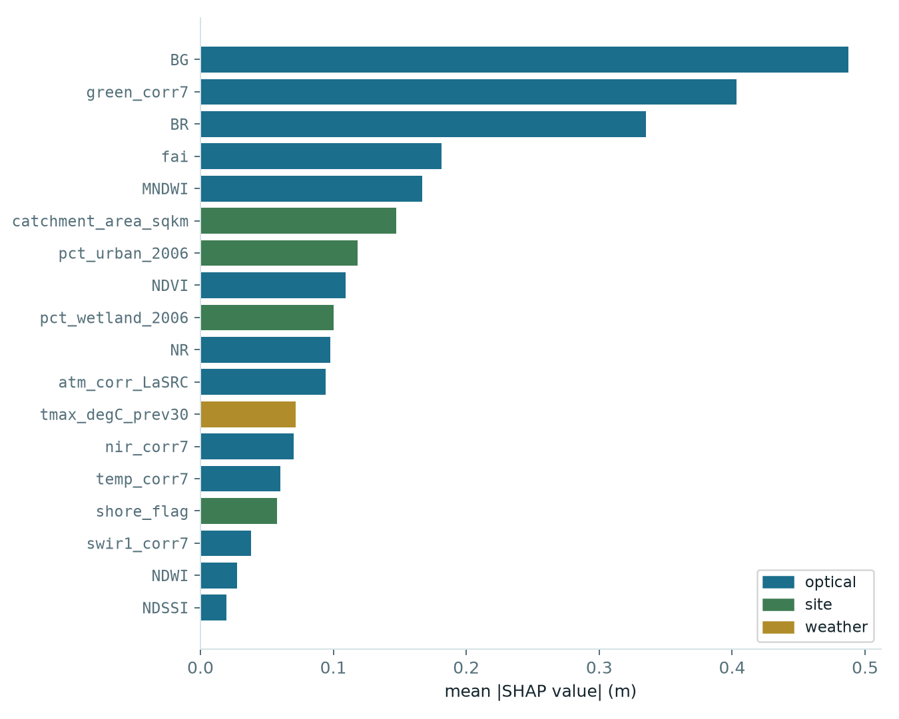

*Mean |SHAP value| per feature, aggregate across the ensemble, colored by optical/site/weather category.*

**SDD-weighting note:** re-tested on the v3 ensemble (k=2.0). Here the trade-off is clearer than in v1/v2 because v3's unweighted overall bias is already near zero: weighting helps the top-quartile group (RMSE 2.036→1.930m, bias −1.195→−0.997m) but pushes overall RMSE slightly worse (1.391→1.399m) and overall bias notably worse (+0.009→+0.147m), plus the "rest" group degrades on both metrics (RMSE 1.034→1.124m). Not adopted as the default — with v3's bias problem already mostly solved by the ensemble itself, weighting has less to offer and a clearer downside than it did in v1/v2.

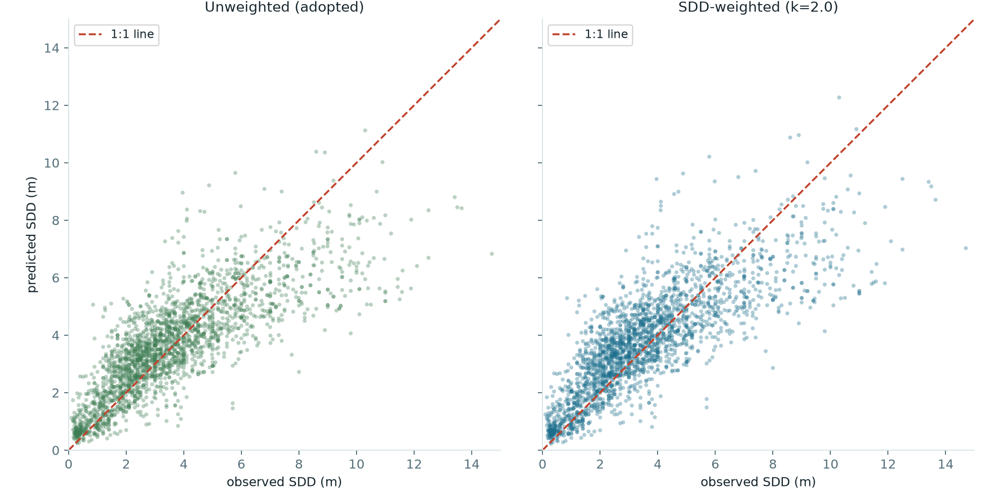

*Predicted vs. observed, unweighted (adopted) vs. SDD-weighted, side by side.*

**Exploratory note — ensemble spread as a confidence interval:** tested whether the 5-seed×2-model ensemble's own spread (already trained, no new models needed) works as a usable interval, and whether CRPS adds anything over RMSE/MAE. Short answer: no, and the numbers show precisely why. Every band tested is dramatically under-covered — the full 10-member min-max range only contains the true observed value 14.9% of the time; mean±1 SD covers just 8.3% (vs. a ~68% target); mean±2 SD covers 18.5% (vs. ~95%). The mean 1-SD half-width is 0.137m against an actual holdout RMSE of 1.339m — the 10 members agree with each other far more than any agree with reality, because they share the same data/features/approach and differ only in CV-fold assignment and architecture (xgboost vs. lightgbm), which is disagreement-between-similar-models, not genuine predictive uncertainty. CRPS on that same 10-member empirical distribution comes out to 0.893m vs. the ensemble mean's MAE of 0.962m — CRPS is lower (as it should be, in theory), but by only ~7%, which is the quantitative signature of the same problem: there's barely any real spread in this ensemble for CRPS to reward. Not adopted; a genuine interval would need a different source of spread (quantile regression, or conformal calibration on held-out residuals), not explored here.

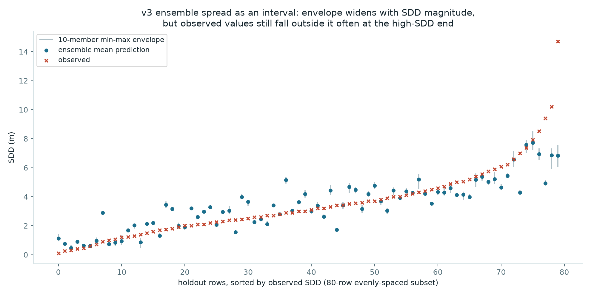

*Ensemble mean prediction + 10-member min-max envelope vs. observed, 80-row evenly-spaced subset sorted by observed SDD.*

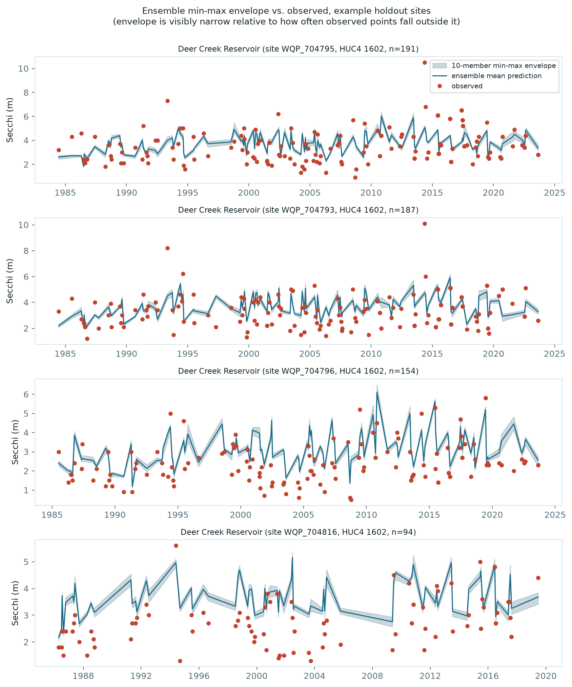

*Same envelope, shown on four well-sampled holdout sites' actual time series rather than a sorted cross-section — the band tracks the mean tightly while observed points fall outside it constantly.*

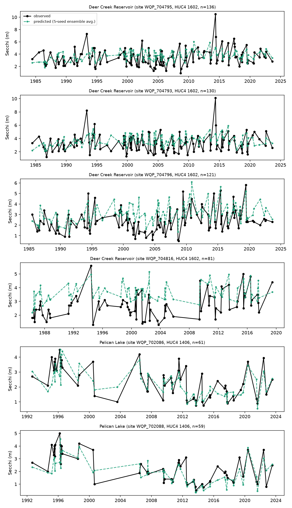

*Observed vs. predicted Secchi depth over time, 5-seed ensemble average, named where a GNIS name exists.*

---

## 6. Harmonizing to LS8 as the reference sensor (LS7-LS9 mocel), and a Landsat 8/9 model

**[Full report](ls8_harmonization/report.html)**

Two questions from one shared 5-seed-ensemble setup: does referencing cross-sensor harmonization to Landsat 8 (instead of the Landsat 7 every prior report used) help? And can Landsat 8/9 data alone with no cross sensor correction carry a model? This is stored in the `ls8_harmonization` folder.

**Takeaway:** switching to an LS8 reference is a marginal improvement (RMSE −1.4%), driven partly by the blue band and green/red ratio becoming reliably useful only under that reference. This appears to be genuine new spectral information, not feature-swapping. This is at the necessary cost of dropping Landsat 4/5 (44% of the corpus, no LS5→LS8 coefficient exists upstream). Further, a LS8/9-only corpus (1,925 rows, 15% of the full data) is viable: typical-case accuracy (MAE, R²) matches or marginally improves from the full corpus, including at Lake Powell specifically, despite 73% less training data. The cost for a LS8/9 model is noisier feature selection, not necessarily worse predictions and not better predictions either.

**SHAP/feature assessment (new):** run fresh for all three models (same design as v3's SHAP analysis — each seed's own selected features/hyperparameters, holdout never trained on). Optical signal dominates in every model (72–80% of total attribution), site features pick up more of the remainder for LS8/9-only (28%) than the full-corpus model (~20–22%), and no model gives weather meaningful weight. `GR` and `blue_corr8` — the two features newly-unanimous under the LS8 reference — are real but marginal SHAP contributors, not dominant ones. The LS8-ref model's SHAP independently re-derives v3's Lake Powell catchment-area finding via a completely different corpus/reference.

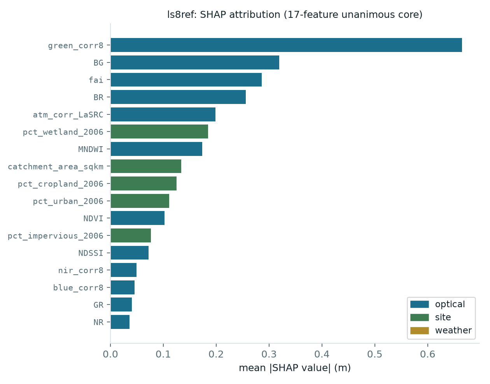

*Mean |SHAP value| per feature, LS8-ref model's 17-feature unanimous core.*

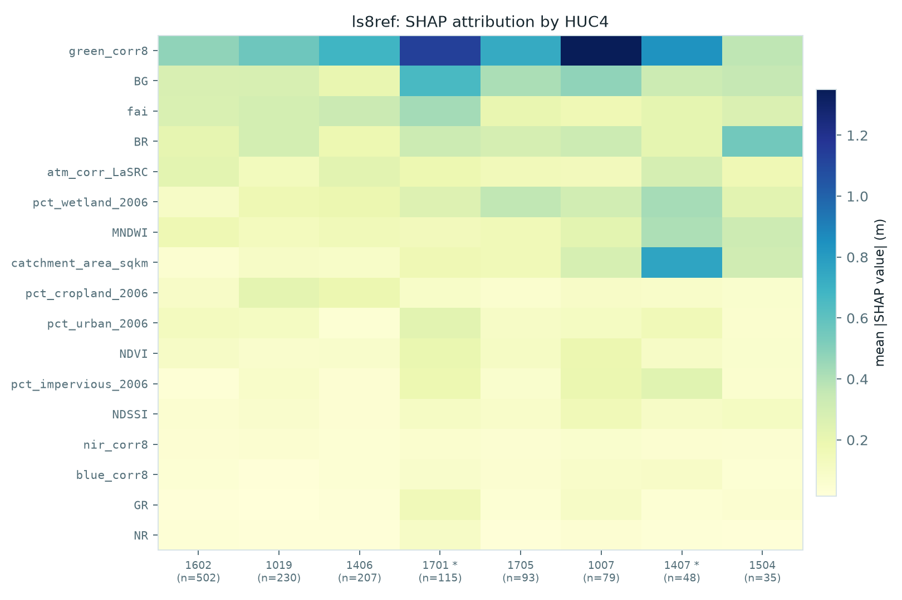

*Mean |SHAP value| by feature and HUC4, LS8-ref model.*

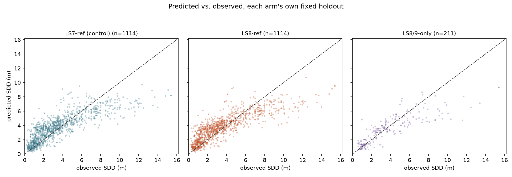

*Predicted vs. observed SDD, all three sensor variations side by side, each on its own fixed holdout.*

Note the continued benching performance above 6m.

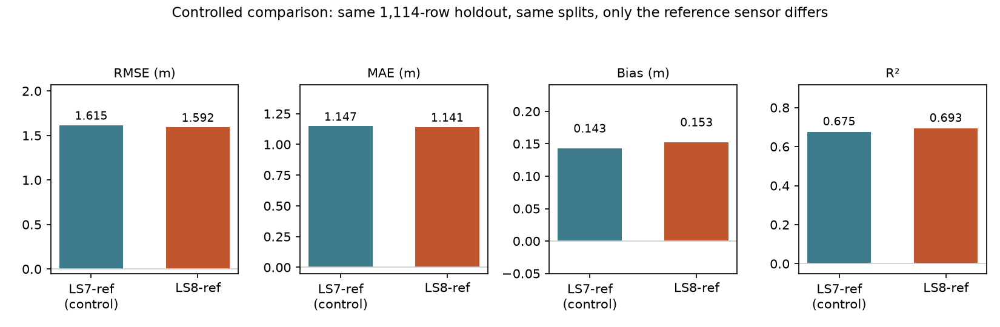

*RMSE/MAE/bias/R², LS7-ref control vs. LS8-ref, identical rows and splits.*

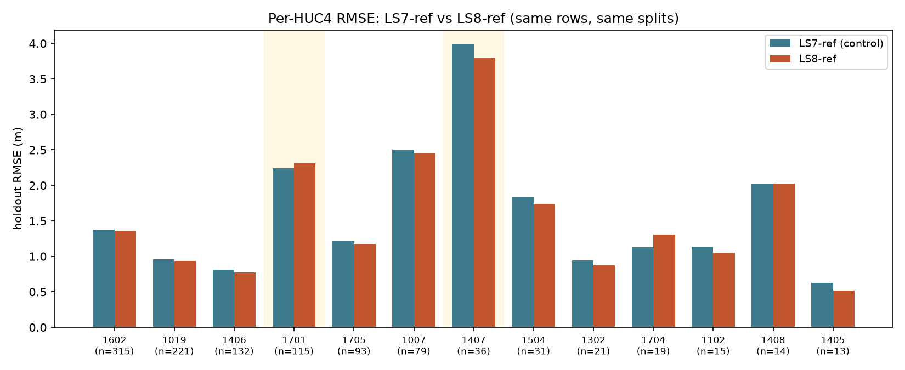

*Holdout RMSE by HUC4, LS7-ref vs. LS8-ref.*

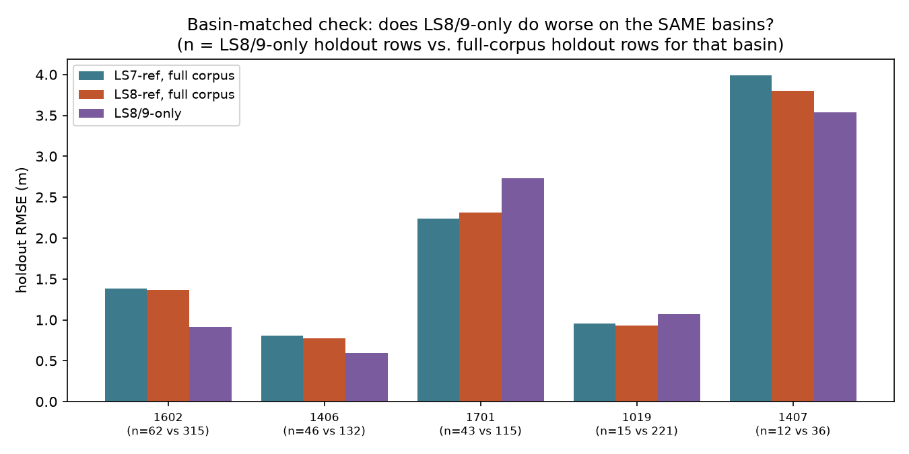

*Basin-matched holdout RMSE, full-corpus model vs. LS8/9-only, restricted to shared basins.*

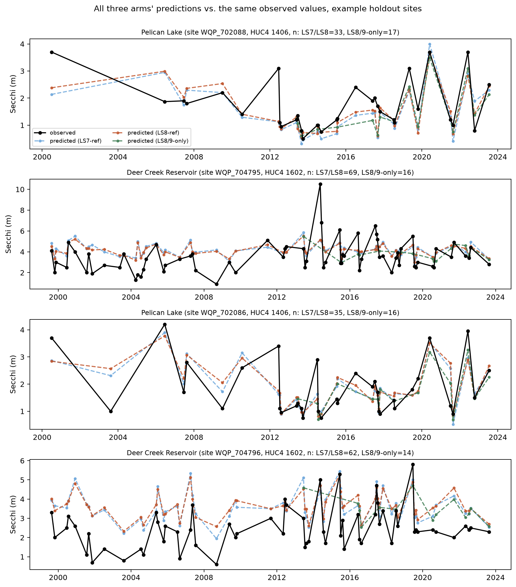

*Observed vs. predicted Secchi depth over time, all three arms' 5-seed ensemble predictions on the same sites/observations, named where a GNIS name exists. LS7-ref and LS8-ref track each other closely (same rows/splits); LS8/9-only is sparser (LC08/LC09 dates only) and diverges more.*

**SDD-weighting note:** examined for all three models. Same shape as every prior report: weighting narrows the top-quartile gap (LS8-ref RMSE 2.434→2.308m, bias −1.584→−1.415m) but leaves overall RMSE flat-to-worse (1.592→1.597m) with overall bias moving further from zero (+0.153→+0.276m), and the "rest" group getting worse on both metrics — the LS8/9-only model is the one exception where weighting also helps overall RMSE slightly (1.667→1.610m), likely a smaller-sample-size effect. Not adopted as default for any model.

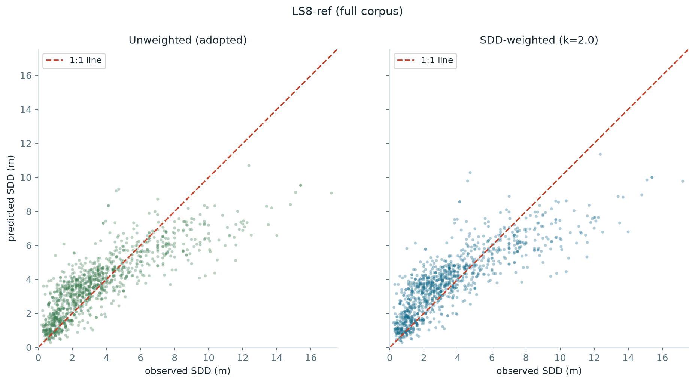

*Predicted vs. observed, unweighted vs. SDD-weighted, LS8-ref arm.*

**Overtraining check (LS8/9-only, 73% less data, same hyperparameter search space):** checked directly from each seed's saved in-CV vs. held-out-test RMSE, no retraining needed. LS8/9-only's mean CV→test gap (23.3%) tracks the full-corpus control model's (22.4%) rather than blowing out — it's the noisiest of the three (17.3–27.8% across seeds×models) but not disproportionately worse, and the tuned hyperparameters (tree depth, regularization) aren't measurably more permissive for this model specifically. Reads as "not obviously overtraining," with the caveat that 5 seeds×2 models is a small sample for characterizing that spread.

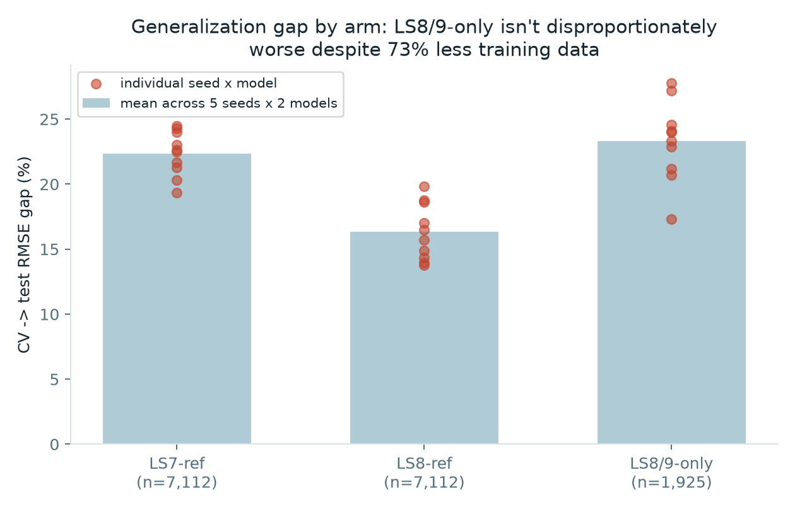

*CV→test RMSE gap (%), individual seed×model points plus model means.*

