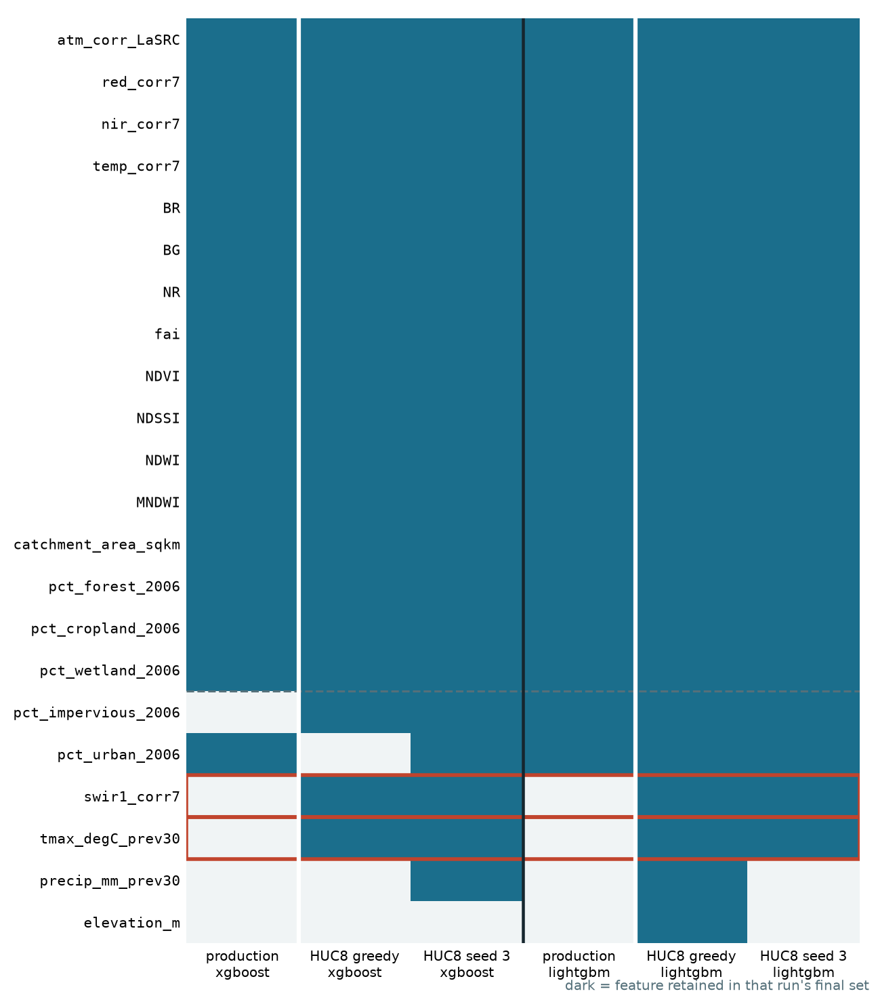
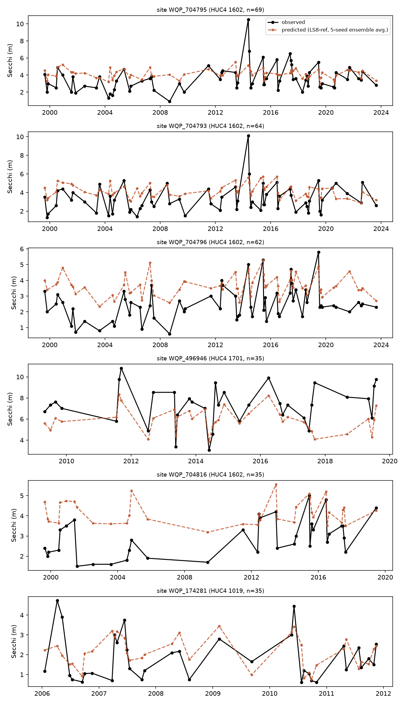

# Regional Clarity RS Model — overview of Claude's work

Six reports, built in sequence, all predicting Secchi disk depth (SDD, water clarity) from Landsat surface reflectance across a 6-state Mountain West region. Each one answers a question raised by the one before it: build the pipeline → close two deferred threads → find out why two partitions perform badly → find out if that's a fluke of one split → rebuild on a real ensemble of splits → test whether a different cross-sensor reference (and a smaller, simpler sensor set) helps. This is the top-line takeaway and supporting figures for each — click through to "Full report" for the complete write-up.

All reports live under `regional_clarity/` on branch `outlier-removal-rework`.

---

## 1. `outlier_rework` — the foundation

**[Full report](outlier_rework/python/report.html)**

Built the modeling pipeline from scratch: training-data construction (5-day Landsat/field-sample matching, 12,637 rows), cross-sensor harmonization, feature engineering, and a three-way model comparison (XGBoost, LightGBM, a feedforward neural net) under 5-fold HUC4 spatial CV.

**Takeaway:** the final, properly-tuned production config (16-feature intersection set, gap-aware hyperparameters, SDD-weighted for the tree models) reached test RMSE **1.86m (XGBoost) / 1.83m (LightGBM) / 1.84m (NN)**, R²≈0.45–0.48. The honest, reported-as-is finding: this careful, regularized final model actually did *worse* on the held-out test partition than an earlier, richer 33-feature/unweighted checkpoint (RMSE 1.747m, R²=0.508) — every later report in this series traces back to chasing down why.

| | |
|---|---|
|  |  |

---

## 2. `outlier_rework_v2` — two deferred threads

**[Full report](outlier_rework_v2/python/report.html)**

Closed two things v1 deferred: gap-aware hyperparameter selection applied at *every* tuning stage (not just the final one), and a shoreline-proximity flag added as a candidate feature.

**Takeaway:** the shoreline flag **survived backward elimination in all 3 models** — the most consistent feature addition tested up to that point. Net effect on production: a modest improvement for the tree models (XGBoost 1.860→1.839m, LightGBM 1.830→1.815m) and a small regression for the NN (1.839→1.888m). Optical signal still dominates attribution (61–68%).

| | |
|---|---|
|  |  |

---

## 3. `outlier_investigation` — why do two partitions fail?

**[Full report](outlier_investigation/report.html)**

v1 and v2 both showed test partition 5 underperforming CV by more than expected. This report asks why, directly — for partition 5 (test) and partition 3 (the worst CV fold), not just whether tuning could paper over it.

**Takeaway:** every model compresses predictions toward the regional mean above ~6–10m SDD (a real Landsat optical-retrieval limit, not a modeling defect) — partitions 3 and 5 just *concentrate* that regime 2–3x their proportional share. Partition 3 is 54% one forested, naturally-clear lake cluster (HUC4 1701); partition 5 is dominated by Lake Powell (HUC4 1407), which also sits at the 97th percentile of its own training data for catchment area — a training-density problem stacked on the signal problem. Recommendation: don't drop this data, build a bigger ensemble of splits (→ report 4, then 5).

| | |
|---|---|
|  |  |
|  |  |

---

## 4. `partition_sensitivity` — is that a fluke of one split?

**[Full report](partition_sensitivity/report.html)**

Tests whether partitions 3/5's problem is structural or just an artifact of the one HUC4-grouped split every prior report used. Reuses v1's frozen model (same 16 features, same hyperparameters) unchanged, so this report's own contribution is entirely about how RMSE moves under different split designs — see reports 1–2 above for that same model's pred-vs-obs and time-series behavior.

**Takeaway:** structural, and no single alternative split reliably fixes it. Rotating which HUC4 partition plays test reproduces partitions 3 and 5 as consistently worst regardless of label. Regrouping at HUC8 resolution with the same algorithm doesn't fix it, just relocates it (a different partition becomes worst). Randomizing HUC8 assignment order helps on average (~10–18% less rotation-to-rotation spread) but not for every seed. Conclusion: there's no better split to search for — the fix is an ensemble across many split assignments (→ report 5).

| | |
|---|---|
|  |  |
|  |  |

---

## 5. `outlier_rework_v3` — the ensemble rebuild

**[Full report](outlier_rework_v3/report.html)**

A full top-to-bottom rebuild on a genuine ensemble: one fixed holdout no model ever trains on, plus 5 independent HUC8-random CV-fold arrangements, each running its own complete feature-selection + tuning pipeline. Also tests a new binary `shore_flag` feature, gap-aware tuning depth, and SDD-weighting, all from one shared setup.

**Takeaway:** beats v1's frozen production config by a real, controlled margin on identical splits — RMSE 1.432→1.391m (−2.9%), MAE −4.5%, and v1's systematic over-prediction bias very nearly eliminated (+0.142m → +0.009m). `shore_flag` survives unanimously (10/10 seeds×models). SHAP confirms the model leans on physically sensible features and independently re-derives the Lake Powell finding from report 3 via a completely different method (its catchment-area importance is concentrated almost entirely at that one basin).

| | |
|---|---|
|  |  |
|  |  |

---

## 6. `ls8_harmonization` — a different reference sensor, and Landsat 8/9 alone

**[Full report](ls8_harmonization/report.html)**

Two questions from one shared 5-seed-ensemble setup: does referencing cross-sensor harmonization to Landsat 8 (instead of the Landsat 7 every prior report used) help? And can Landsat 8/9 data alone — no cross-sensor correction needed at all — carry a model?

**Takeaway:** switching to an LS8 reference is a real, controlled improvement (RMSE −1.4%, driven partly by the blue band and green/red ratio becoming reliably useful only under that reference — genuine new spectral information, not feature-swapping) — at the necessary cost of dropping Landsat 4/5 (44% of the corpus, no LS5→LS8 coefficient exists upstream). An LS8/9-only corpus (1,925 rows, 15% of the full data) is genuinely viable: typical-case accuracy (MAE, R²) matches or beats the full corpus, including at Lake Powell specifically, despite 73% less training data — the real cost is noisier feature selection, not worse predictions.

| | |
|---|---|
|  |  |
|  |  |

---

## Also in progress

**`ransac_shoreline_rework/`** — not a report yet. Confirmed (and then re-confirmed, after finding the fix had actually already shipped in `outlier_rework/10_final_pipeline.R` three days earlier) that the band-outlier RANSAC filter now runs per-site regardless of shoreline flags. Next: propagating that already-in-production fix's implications downstream where it hasn't been checked yet.
